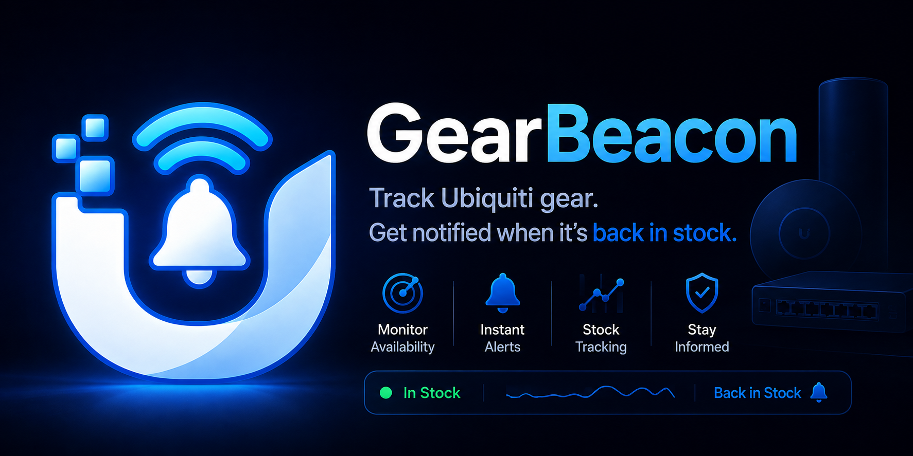

# GearBeacon

**Know the second it's back.**

GearBeacon is a private, self-hosted Ubiquiti and UniFi Store inventory monitor. One installation provides a browser dashboard, regional watchlists, reliable notifications, and an upgrade-safe SQLite database on a Windows PC, Mac, Linux server, NAS, or Docker host.

There is no GearBeacon cloud account, hosted database, public registration, subscription, analytics, or telemetry. GearBeacon is independent and is not affiliated with or endorsed by Ubiquiti Inc.

## What it does

- Monitors the United States, Canada, Europe, and United Kingdom UniFi Stores from one private installation.
- Keeps separate watchlists, product state, activity, and health for every enabled region.
- Detects restocks, sellouts, price changes, status changes, and newly listed products.
- Shows a focused product view with current availability, store details, first/last-seen times, price history, and recent changes.
- Supports per-product alert overrides, price-drop and target-price rules, immediate restocks, and temporary or indefinite pauses.
- Searches, filters, sorts, selects, pauses, resumes, and removes watched products in bulk.
- Delivers browser, ntfy, Discord, Gotify, SMTP email, or generic webhook alerts.
- Queues delivery durably, retries failures with exponential backoff, and supports grouping, cooldowns, quiet hours, and daily digests.
- Can alert the owner when monitoring, delivery, backups, or available disk space need attention.
- Signs generic webhooks with HMAC-SHA256 and supports optional bearer authentication.
- Configures stores, access, backups, and notification integrations in the browser.
- Encrypts saved notification credentials using a generated installation key stored outside SQLite with restricted permissions.
- Protects private and reverse-proxy installations with a single owner password, secure sessions, CSRF checks, origin checks, and security headers.
- Validates catalogs to avoid false stock events when an upstream response is partial.
- Creates validated scheduled, manual, pre-import, and pre-update SQLite backups.
- Exports passphrase-encrypted transfer files and previews them before restoring.
- Shows region health, delivery failures, backup integrity, storage, security warnings, logs, and exact build information in Operations.
- Detects updates but never silently downloads or installs one.

## Choose an installation

### Standalone package — easiest

Download the package for your operating system from [GitHub Releases](https://github.com/alexphillips-dev/GearBeacon/releases). It contains its own Node runtime; Node.js does not need to be installed.

- **Windows x64:** run `GearBeacon.exe` directly, or run `install-windows-service.ps1` from an elevated PowerShell window for automatic startup.
- **macOS Intel or Apple Silicon:** run `./gearbeacon`, or use `sudo ./install-macos-service.sh` for a LaunchDaemon.
- **Linux x64 or ARM64:** run `./gearbeacon`, or use `sudo ./install-linux-service.sh` for a hardened systemd service.

The uninstallers preserve GearBeacon data by default. Their explicit `-RemoveData` or `--remove-data` option is required to delete it. Release packages are currently unsigned; signing and macOS notarization can be added after project certificates are available. Verify the adjacent SHA-256 checksum before installing.

### Source checkout

Requires Node.js 22.13 or newer. No `npm install` is required because the application uses Node's built-in SQLite implementation.

Windows local-only launch:

```text
run-windows.bat
```

macOS or Linux local-only launch:

```bash
chmod +x run-mac-linux.sh
./run-mac-linux.sh
```

Open `http://localhost:8787`.

Use `run-private-windows.bat` or `./run-private-mac-linux.sh` for a trusted LAN or private VPN server. GearBeacon prints a one-time setup token for authenticated first start.

### Docker Compose

```bash
docker compose up -d
docker compose logs gearbeacon
```

Compose first uses the published multi-platform image and can build the included Dockerfile when an image is unavailable. It publishes only `127.0.0.1:8787` on the host by default and persists `/data` in the `gearbeacon-data` volume. Images support `linux/amd64` and `linux/arm64` and run as an unprivileged user.

To build the checkout explicitly:

```bash
docker compose build
docker compose up -d --no-build --pull never
```

## Guided first run

On a new installation, the browser wizard walks through:

1. Creating the private owner password.
2. Selecting UniFi Store regions and the access mode.
3. Adding optional notification channels.
4. Choosing backup interval and retention, then testing the store and notifications.
5. Reviewing the final URL, security state, and any restart requirement.

In authenticated modes, enter the one-time token printed by the process or container before the wizard. A region, bind-address, or access-mode change is saved safely but requires one restart because it changes process-level listeners. Operational settings take effect immediately.

## Access modes

| Mode | Default bind | Owner password | Use |
|---|---|---|---|
| `local` | `127.0.0.1` | Optional | One computer |
| `private` | `0.0.0.0` | Required | Trusted LAN, private VPN, server, or container |
| `proxy` | `127.0.0.1` | Required | HTTPS reverse proxy on the same host |

GearBeacon refuses an unauthenticated `local` server on a non-loopback address. Do not publish it directly to the unrestricted internet. Prefer WireGuard, Tailscale, or another private VPN. If routed access is necessary, terminate HTTPS at a maintained reverse proxy and restrict firewall sources.

Proxy mode accepts `X-Forwarded-Host`, `X-Forwarded-Proto`, and `X-Forwarded-For` only when explicitly enabled. Set an HTTPS public URL so session cookies are `Secure`; forwarded HTTPS responses also receive HSTS.

See [deployment guidance](deploy/README.md) for service installation, Caddy/Nginx examples, recovery, updates, and rollback.

## Data and backup safety

Default data locations:

- Windows source/portable: `%LOCALAPPDATA%\GearBeacon`
- Windows service: `%ProgramData%\GearBeacon`
- macOS portable: `~/Library/Application Support/GearBeacon`
- macOS service: `/Library/Application Support/GearBeacon`
- Linux portable: `${XDG_DATA_HOME:-~/.local/share}/GearBeacon`
- Linux service: `/var/lib/gearbeacon`
- Docker: `/data` in the named volume

The data directory contains the SQLite database, validated backup files, and `secrets.key`. Keep the key with the installation when restoring the database if it contains saved notification credentials. Losing the key does not lose watchlists or history, but encrypted integration secrets must be entered again.

Backups use `PRAGMA integrity_check`, a consistent SQLite `VACUUM INTO` snapshot, and a second integrity check. GearBeacon automatically makes a validated backup before a schema upgrade or import. Encrypted exports use AES-256-GCM with a scrypt-derived key; owner credentials, sessions, and local integration secrets are excluded.

## Notifications

Channel configuration, delivery timing, previews, and individual test buttons are in Settings. A channel can be configured but independently disabled. Restock alerts for watched products are enabled by default; sellout, price, status, and new-product alerts are opt-in.

Each watched product can inherit those global event choices or override them. Product rules can limit price notifications to drops, wait for a target price, pause alerts, or force restocks to deliver immediately. Immediate restocks bypass quiet hours and digest scheduling. Other queued events can be held until quiet hours end, collected for the next daily digest, and suppressed during a configurable per-product event cooldown.

Normal events are written to a persistent SQLite queue before delivery. Failed attempts use exponential backoff up to the configured limit. Operations shows pending/delivered/failed counts, failure reasons, and an owner-controlled retry action. The optional grouping window combines nearby events for the same region and channel.

SMTP port 465 uses implicit TLS. Other SMTP ports require STARTTLS by default, and credentials are never sent on an unencrypted connection. Certificate validation is enabled by default.

Generic webhooks receive JSON and, when a signing secret is configured, these headers:

```text
X-GearBeacon-Timestamp: <unix timestamp>
X-GearBeacon-Signature: sha256=<HMAC of timestamp + "." + exact body>
```

Verify the HMAC against the raw request body and reject stale timestamps at the receiver.

## Operations and updates

The Operations page starts with an overall **Healthy**, **Degraded**, or **Action Required** state and links actionable warnings to the relevant Settings tab. It also includes every region's last/next check, product and watch counts, catalog errors, notification queue outcomes and next delivery, backup history and integrity, database/free-space sizes, security warnings, filtered downloadable logs, runtime architecture, commit, and container image information.

**Check for updates** reads GitHub Releases (or a configured manifest) and shows notes and download links. **Prepare safe update** flushes current state, creates and validates a pre-update backup, and displays the platform command. GearBeacon never performs an unattended update.

Standalone helpers require an explicit backup confirmation flag and validate the release SHA-256 file. Docker updates keep the named data volume. To roll back, stop GearBeacon, restore the validated pre-update SQLite backup, and reinstall or select the previous application/image version.

## Environment configuration

Browser-saved settings are intended for most owners. Environment values seed new installations and remain useful for automation.

| Variable | Default | Purpose |
|---|---:|---|
| `PORT` | `8787` | Dashboard/API port |
| `REGIONS` | `us` | Comma-separated `us`, `ca`, `eu`, `uk` |
| `POLL_SECONDS` | `60` | Poll interval; minimum 30 seconds |
| `GEARBEACON_ACCESS_MODE` | `local` | `local`, `private`, or `proxy` |
| `GEARBEACON_BIND_HOST` | mode default | Listening address |
| `GEARBEACON_SETUP_TOKEN` | random | Optional fixed one-time token |
| `GEARBEACON_OWNER_PASSWORD_FILE` | blank | Initial/recovery password file |
| `GEARBEACON_OWNER_PASSWORD` | blank | Initial/recovery password value |
| `GEARBEACON_RESET_OWNER_PASSWORD` | `0` | Apply configured recovery password and revoke sessions |
| `GEARBEACON_PUBLIC_BASE_URL` | blank | Canonical URL and notification link |
| `GEARBEACON_ALLOWED_ORIGINS` | same origin | Extra browser origins |
| `GEARBEACON_COOKIE_SECURE` | URL detection | Force `Secure` cookies |
| `GEARBEACON_DATA_DIR` | OS data folder | Persistent data override |
| `GEARBEACON_BACKUP_INTERVAL_HOURS` | `24` | `0` disables scheduled backups |
| `GEARBEACON_BACKUP_RETENTION` | `10` | Database backups to retain |
| `GEARBEACON_HISTORY_RETENTION_DAYS` | `365` | Change-only product history retention |
| `GEARBEACON_NOTIFICATION_MAX_ATTEMPTS` | `5` | Delivery attempt limit |
| `GEARBEACON_NOTIFICATION_GROUP_SECONDS` | `0` | Optional event grouping window |
| `GEARBEACON_NOTIFICATION_COOLDOWN_MINUTES` | `30` | Suppress duplicate product/event alerts during this window |
| `GEARBEACON_TIME_ZONE` | system timezone | IANA timezone for schedules |
| `GEARBEACON_QUIET_HOURS_ENABLED` | `0` | Hold normal alerts during quiet hours |
| `GEARBEACON_QUIET_HOURS_START` / `GEARBEACON_QUIET_HOURS_END` | `22:00` / `07:00` | Local quiet-hours window |
| `GEARBEACON_DIGEST_ENABLED` / `GEARBEACON_DIGEST_TIME` | `0` / `09:00` | Enable and schedule a daily digest |
| `GEARBEACON_ALERT_MONITOR_FAILURES` | `1` | Alert after repeated store-check failures |
| `GEARBEACON_ALERT_NOTIFICATION_FAILURES` | `1` | Alert when a channel exhausts delivery attempts |
| `GEARBEACON_ALERT_BACKUP_FAILURES` | `1` | Alert when a scheduled backup fails |
| `GEARBEACON_ALERT_LOW_DISK` | `1` | Alert when less than 1 GB remains |
| `NTFY_BASE_URL` / `NTFY_TOPIC` / `NTFY_TOKEN` | blank | ntfy integration |
| `DISCORD_WEBHOOK_URL` | blank | Discord webhook |
| `GOTIFY_BASE_URL` / `GOTIFY_TOKEN` | blank | Gotify integration |
| `GEARBEACON_WEBHOOK_URL` | blank | Generic webhook |
| `GEARBEACON_WEBHOOK_TOKEN` | blank | Optional bearer token |
| `GEARBEACON_WEBHOOK_HMAC_SECRET` | blank | Optional signing secret |
| `SMTP_HOST` / `SMTP_PORT` | blank / `587` | SMTP server |
| `SMTP_SECURE` | port-based | Implicit TLS |
| `SMTP_STARTTLS` | `1` | Require STARTTLS when not using implicit TLS |
| `SMTP_REJECT_UNAUTHORIZED` | `1` | Validate SMTP certificate |
| `SMTP_USER` / `SMTP_PASSWORD` | blank | SMTP credentials |
| `SMTP_FROM` / `SMTP_TO` | blank | Sender and recipients |
| `GEARBEACON_BUILD_COMMIT` / `GEARBEACON_IMAGE` | blank | Build provenance shown in Operations |
| `GEARBEACON_GITHUB_RELEASE_API` | project releases | Manual update source; blank disables |
| `GEARBEACON_UPDATE_MANIFEST_URL` | blank | Custom update channel |
| `GEARBEACON_MIN_CATALOG_RATIO` | `0.55` | Partial-catalog rejection threshold |
| `GEARBEACON_STALE_AFTER_SECONDS` | at least `180` | Stale monitor threshold |
| `MOCK_MODE` | `0` | Offline demonstration catalog/database |

See [.env.example](.env.example) for a copyable template.

## API and health

Only liveness, readiness, and authentication bootstrap routes work without an owner session in authenticated modes. State-changing authenticated requests also require the session's `X-CSRF-Token`.

- `/healthz`, `/readyz`, `/api/health` — process and monitor health
- `/api/auth/*`, `/api/onboarding/complete` — owner access and setup
- `/api/config`, `/api/config/validate` — sanitized configuration and validation
- `/api/products`, `/api/products/:slug`, `/api/watchlist`, `/api/watch/*`, `/api/events`, `/api/check` — regional monitor data, details, history, and per-product rules
- `/api/notifications/*` — preferences, scheduling preview, individual tests, queue retry, and delivery history
- `/api/operations`, `/api/logs` — private operational view and filtered log export
- `/api/data/*` — integrity, backup, export, preview, and import
- `/api/update/check`, `/api/update/prepare` — manual release information and validated preparation

## Development and verification

```bash
node scripts/check-versions.mjs
npx --yes -p typescript@5.8.3 tsc -p backend/tsconfig.json
node --check web/app.js
node scripts/check-web-contract.mjs
node --no-warnings scripts/self-test.mjs
node --no-warnings scripts/browser-smoke.mjs
docker compose build
```

CI exercises fresh installs and database upgrades on Windows, macOS, and Linux; real Chrome workflows at desktop and compact widths; browser configuration; product images, history, rules, scheduling and bulk actions; encrypted backup preview/restore; integration-secret encryption; every notification mock; webhook signing; SMTP STARTTLS; authentication, CSRF, origin, secure-cookie, and forwarded-header behavior; launcher syntax; real Docker Compose startup; amd64/arm64 containers; and native standalone packages. CodeQL and Trivy scan source and container images.

Tagged releases produce checksummed standalone packages for Windows x64, macOS x64/ARM64, and Linux x64/ARM64, plus amd64/arm64 GHCR images. Standalone builds use Node's single-executable application tooling.

## Project layout

| Path | Purpose |
|---|---|
| `backend/src` / `backend/dist` | Server source and compiled CommonJS application |
| `web` | Browser dashboard and assets |
| `deploy` | Service installers, uninstallers, updaters, and hosting guidance |
| `scripts` | Version, integration, STARTTLS, packaging, and smoke tests |
| `.github/workflows` | Cross-platform CI, security scans, and releases |

Release-specific history belongs in [CHANGELOG.md](CHANGELOG.md), keeping this README current and readable.

## License and trademarks

Copyright 2026 alexphillips-dev. GearBeacon is licensed under the [Apache License 2.0](LICENSE); see [NOTICE](NOTICE).

Ubiquiti and UniFi are trademarks of their respective owner. The license does not grant permission to use GearBeacon or third-party trademarks beyond applicable law.
